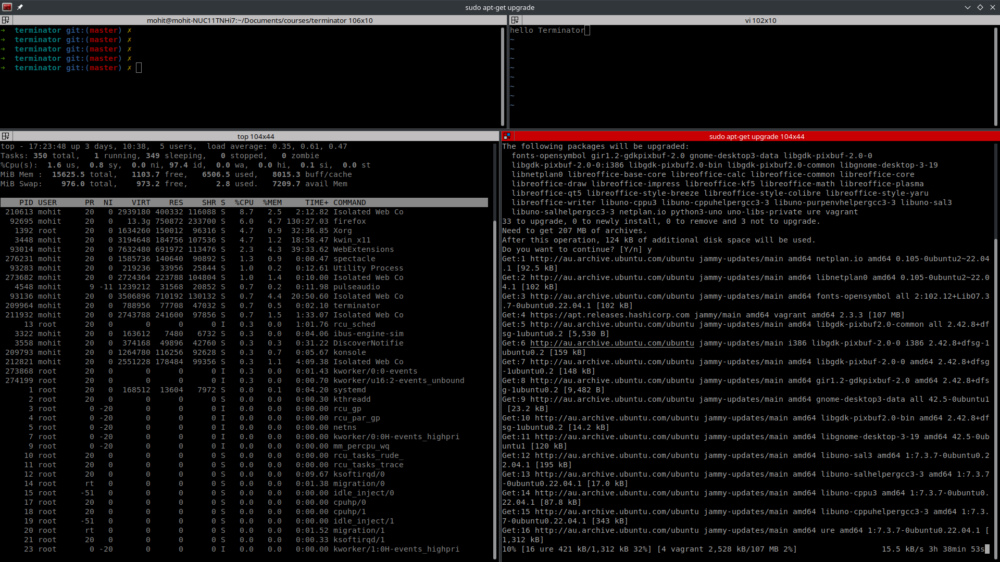

# Terminator
### A simple terminator walkthrough

- *Terminator* is a terminal emulator like xterm, gnome-terminal, konsole, etc. 
- Arrange terminals in a grid-like structure
- Tabs
- Drag and drop re-ordering of terminals
- Lots of keyboard shortcuts
- Save multiple layouts and profiles via GUI preferences editor
- Simultaneous typing to arbitrary groups of terminals
- Extensible through plugins

[Terminator Home Page](https://terminator-gtk3.readthedocs.io/en/latest/)

## Udemy Course

## Youtube videos

## Contributing

## Discussion
