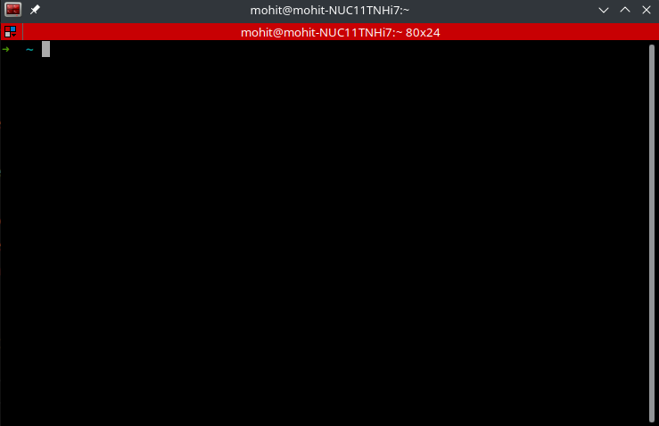

# Terminator - The Terminal manager

By - **Mohit Kumar**

---

# What is Terminator

- *Terminator* is a terminal emulator like xterm, gnome-terminal, konsole, etc. 
- Arrange terminals in a grid-like structure
- Tabs
- Drag and drop re-ordering of terminals
- Lots of keyboard shortcuts
- Save multiple layouts and profiles via GUI preferences editor
- Simultaneous typing to arbitrary groups of terminals
- Extensible through plugins

[Terminator Home Page](https://terminator-gtk3.readthedocs.io/en/latest/)

---

# Installing terminator

Terminator can be installed for any Linux distro.

## Ubuntu

`sudo apt-get install terminator`

## Centos/Redhat

`sudo dnf copr enable mattrose/python3-terminator`
`sudo dnf repolist`
`sudo dnf install terminator `

---
# Getting started

---

# Windows Management

---

# Keyboard shortcuts

- New Instance - `Super + i`
- New Window - `Shift + Ctrl + I`
- New Tab - `Shift + Ctrl  + T`
- Split terminal horizontally - `Shift + Ctrl + O`
- Split terminal vertically - `Shift + Ctrl + e`
- Close window - `Shift + Ctrl + W`
- Page up/down - `Shift + pg/up/down`
- Toggle Fullscreen - `F11`

---
# Keyboard shortcuts (2)

- Resize Terminal - `Shift + Ctrl + Up/Down/Left/Right`
- Rotate Terminals clockwise - `Super + R`
- Rotate Terminals anti-clockwise - `Shift +Super + R`
- Move tab - `Shift+ Ctrl , Pg/Up/Down`
- Zoom Terminal - `Shift + Ctrl + Z`
- Maximise Terminal - `Shift + Ctrl + x`
- Toggle Scrollbar - `Shift + Ctrl + S`
- Search - `Super + Ctrl + F`

---

# Setting Titles

- Window Title - `ctrl + alt + w`
- Tab title - `Ctrl + Alt + W`
- Terminal title - `Ctrl + Alt + X`

---

# Grouping

- Group all - `Super + G`
- Ungroup all - `Shift + Super + G`

(Only using mouse)
- Create groups and attach tabs

---
# Understanding Grouping

- Red - The current terminal and broadcaster.
- Blue - A terminal that is in the same group as the broadcaster.
- Grey - A terminal in a different group, or no group.

---

# Broadcasting

- Broadcast off 	`Alt+O`
- Broadcast all 	`Alt+A`
- Broadcast group 	`Alt+G`

